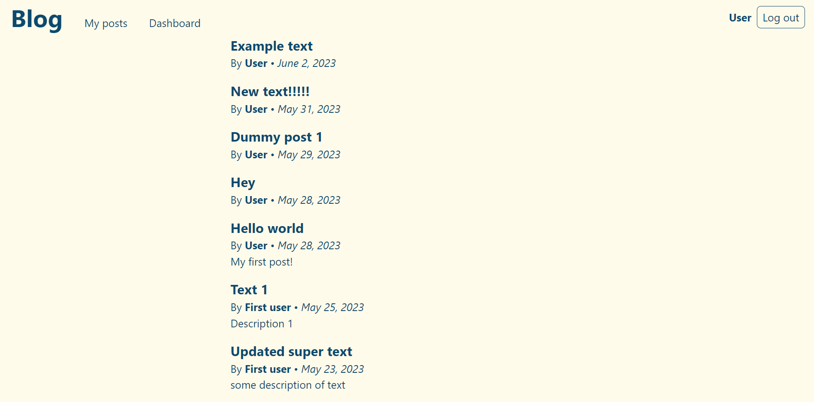
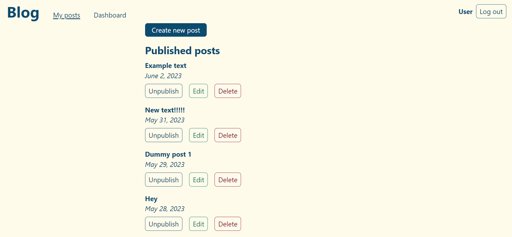
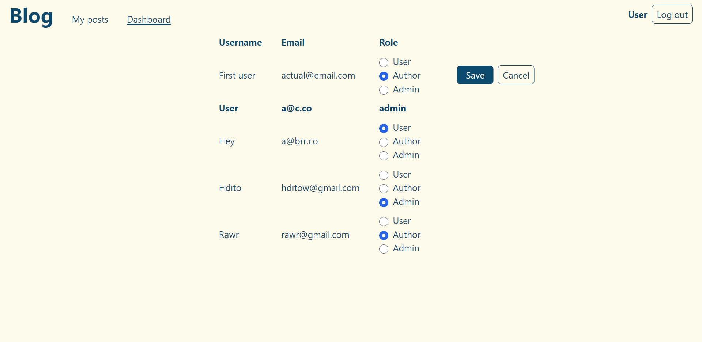

# blog-client

App for demonstration functionality of [blog-api](https://github.com/hdito/blog-api)

## Project Setup

1. After successful start of blog-api server pass its URL to env variable `VITE_API_URL` in the file `.env.development` placed in the root.

2. Install dependencies

```sh
pnpm install
```

3. Start development server

```sh
pnpm dev
```

## Screenshots






